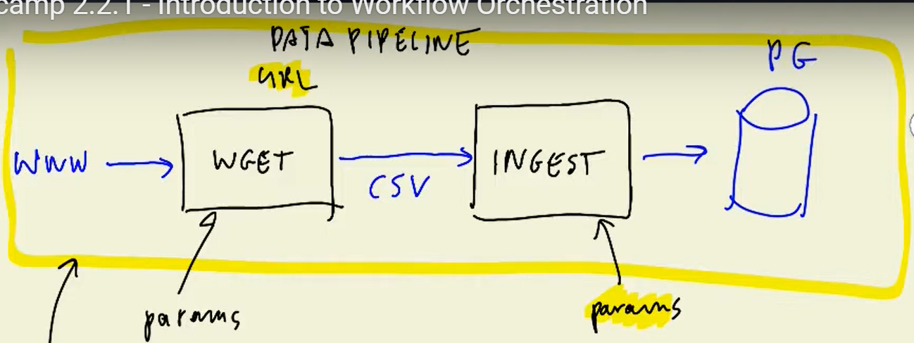
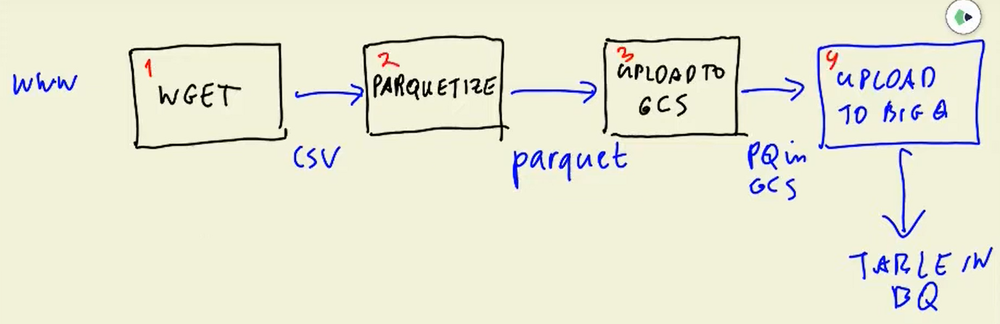

# Week 2

> [!IMPORTANT]
Since I want to learn Apache Airflow, I am following the 2022 cohort version of this week. 
The most recent version of the course covering this week ([2024 cohort](https://github.com/DataTalksClub/data-engineering-zoomcamp/tree/main/02-workflow-orchestration)) uses Mage. I'll skim the material and might do a second pass at some point, if I find it necessary.

## [DE Zoomcamp 2.1.1 - Data Lake](https://www.youtube.com/watch?v=W3Zm6rjOq70&list=PL3MmuxUbc_hJed7dXYoJw8DoCuVHhGEQb)

### What is a Data Lake?

A Data Lake is a central repository that holds big data from many sources. 
The data it holds can either be structured, semi-structured, or unstructured.

Data Lakes are extensively used for ML and analytics. They also make use of metadata for faster access to data.

Data Lake solutions need to be secure, scalable, and its HW inexpensive to be able to store as much data as quickly as possible.

### Data Lake vs Data Warehouse
- Data lake: 
    - Unstructured data
    - Target users are data scientists/analysts
    - Huge amounts of data (petabytes)
    - Use cases: stream processing, ML, real-time analytics
- Data warehouse: 
    - Structured data
    - Target users are business analysts
    - Smaller amounts of data (petabytes)
    - Use cases: batch processing or BI reporting

### How did it start? / Why did Data Lakes become popular?
- Companies realized the value of data
- Data cannot always be well-defined from the get go. Store now and figure out what to do with it later. Data Lakes allow for this.
- Increase in Data Scientists and R&D on data products
- This prompted the need for cheap storage of Big Data

### ETL vs ELT
- ETL = Export-Transform-Load
    - Mainly used for small amount of data
    - Provides support for Data Warehouse (Schema on Write)
        - First define schema, then write data
- ELT = Export-Load-Transform
    - Mainly used for large amount of data
    - Provides support for Data Lake (Schema on Read)
        - First write (store) data, define relationships when reading data

### Data Lake Pitfalls
- Data Swamp
    - Makes it very hard to use the data
    - Can happen due to lack of versioning, conflicting schemas, lack of metadata
    - Joins not possible (e.g. no foreign key available)

### Data Lake Cloud Solutions by Various Providers
- GCP: Cloud Storage
- AWS: S3
- Azure Blob

## [DE Zoomcamp 2.2.1 - Introduction to Workflow Orchestration](https://www.youtube.com/watch?v=0yK7LXwYeD0&list=PL3MmuxUbc_hJed7dXYoJw8DoCuVHhGEQb)

### What is Workflow Orchestration?

Data pipeline takes data as input, does something, then outputs the data in a different form.

The pipeline downloads csv data from internet, then reads it, then inserts to a Postgres database.

This is not a very good idea, because if either the download fails or the database connection fails, the entire script fails and have to start over.

Better to create multiple files:
- Download data
- Ingest csv to postgres

Also we can parametrize the various scripts or execute them at separate intervals.

How can we set it up? 
- For example we can do 2 Python scripts and 1 bash script.
- Make ingest (?)

During week 2 a different pipeline will be made:
- First download with wget
- Parquetize
- Upload to GSC (possibly also to AWS S3 in parallel)
- Upload to BigQuery

Each step depends on the previous step, so need to execute in order and verify success of previous step.

Rather than a pipeline, this is sometimes also called a Workflow or DAG (Directed Acyclic Graph).

We have this workflow, but how do we orchestrate this to ensure:
- Workflow dependencies are respected
- Retry mechanism is in place
- Workflow is parametrized
- Logs/history can easily be inspected

We can use Make, but this is more suitable for smaller workflows. For Data Workflow Orchestration following tools are used:
- Luigi
- Apache Airflow (one of the more popular ones)
- Mage
- Prefect

## [DE Zoomcamp 2.3.1 - Setup Airflow Environment with Docker-Compose](https://www.youtube.com/watch?v=lqDMzReAtrw&list=PL3MmuxUbc_hJed7dXYoJw8DoCuVHhGEQb)

## [DE Zoomcamp 2.3.4 - Optional: Lightweight Local Setup for Airflow](https://www.youtube.com/watch?v=A1p5LQ0zzaQ&list=PL3MmuxUbc_hJed7dXYoJw8DoCuVHhGEQb)

## [DE Zoomcamp 2.3.2 - Ingesting Data to GCP with Airflow](https://www.youtube.com/watch?v=9ksX9REfL8w&list=PL3MmuxUbc_hJed7dXYoJw8DoCuVHhGEQb&index=19)

## [DE Zoomcamp 2.3.3 - Ingesting Data to Local Postgres with Airflow](https://www.youtube.com/watch?v=s2U8MWJH5xA&list=PL3MmuxUbc_hJed7dXYoJw8DoCuVHhGEQb)

## [DE Zoomcamp 2.4.1 - Moving Files from AWS to GPC with Transfer Service](https://www.youtube.com/watch?v=rFOFTfD1uGk&list=PL3MmuxUbc_hJed7dXYoJw8DoCuVHhGEQb)

## [DE Zoomcamp 2.4.2 - Configuring the Transfer Service with Terraform](https://www.youtube.com/watch?v=VhmmbqpIzeI&list=PL3MmuxUbc_hJed7dXYoJw8DoCuVHhGEQb)

